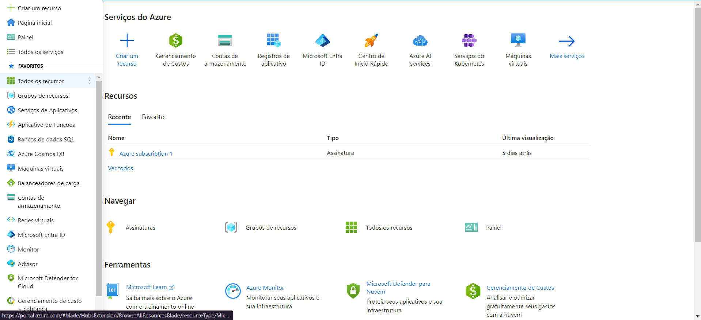
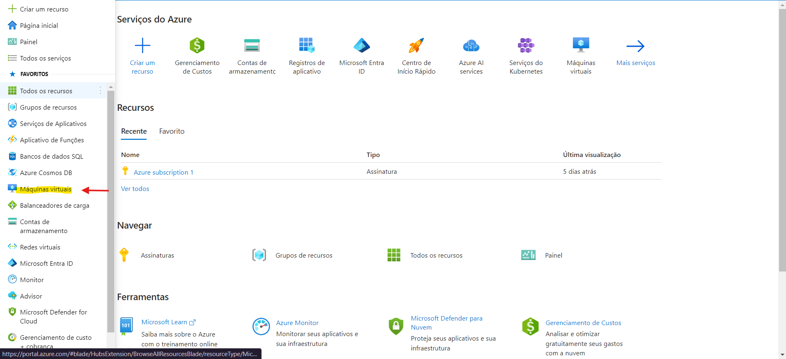
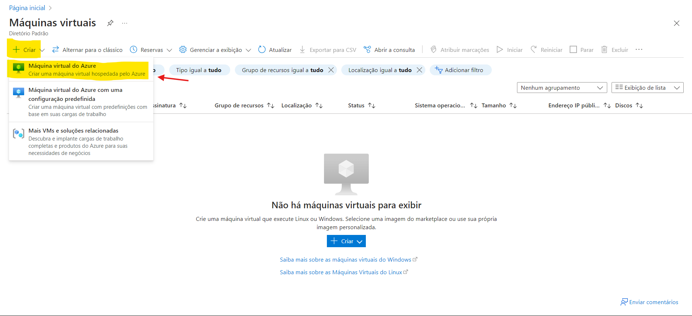
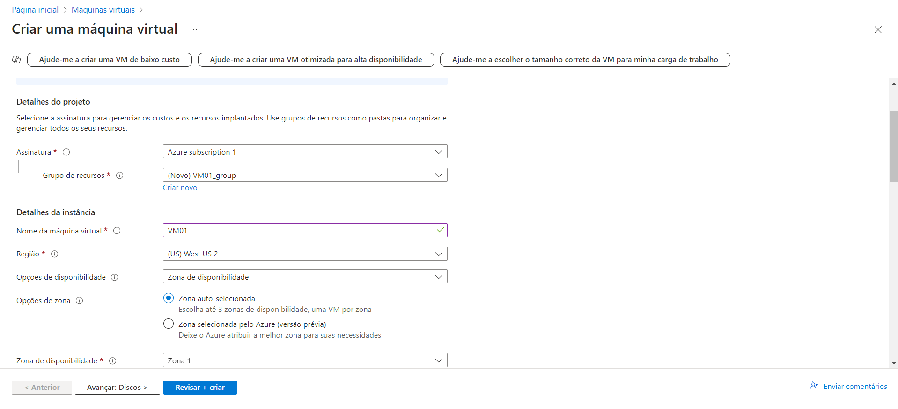
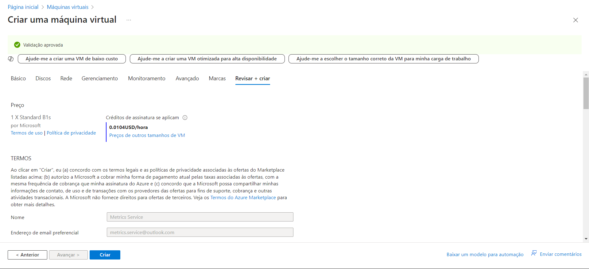
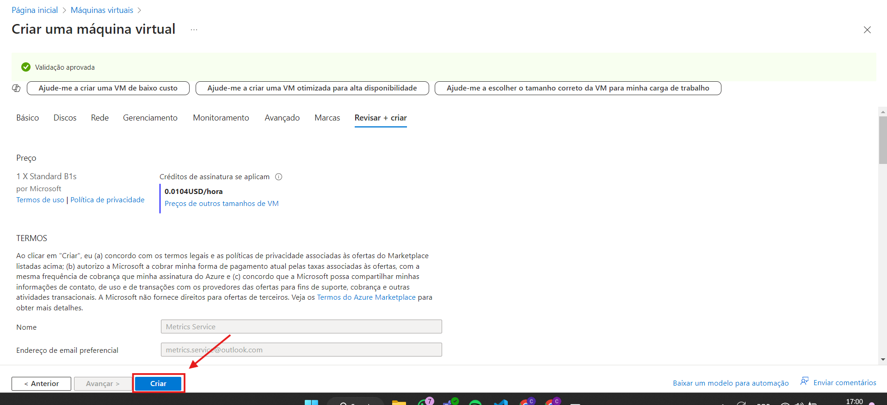

# Desafio 1: Criando uma Máquina Virtual no Azure

Criar uma máquina virtual no Azure é um processo bem tranquilo. Vou mostrar o passo a passo que segui para configurar a minha rapidamente.

### Passo 1: Acessar o Portal do Azure
Primeiro, entrei no [Portal do Azure](https://portal.azure.com) usando minha conta. Esse é o ponto de partida para criar e gerenciar suas VMs.  

### Passo 2: Acessar a Seção de Máquinas Virtuais
Depois de logar, no menu lateral à esquerda, fui até a opção **"Máquinas Virtuais"**. É ali que todas as suas máquinas ficam listadas e onde você pode criar novas.  

### Passo 3: Começar a Criação da VM
No topo da tela, cliquei no botão **"+ Criar"**. Aí, aparece um menu com algumas opções, e eu escolhi a que fazia mais sentido para o que eu precisava.  

### Passo 4: Configurar a Máquina Virtual
Na próxima etapa, preenchi as informações necessárias no formulário que apareceu. Os campos obrigatórios vêm marcados com um asterisco (\*), e os que não são obrigatórios podem ser deixados com as configurações padrão, caso você não tenha preferências específicas.  

### Passo 5: Revisar as Configurações
Antes de finalizar, cliquei em **"Revisar + Criar"**. Nessa parte, o Azure faz um resumo de todas as configurações que fiz e também mostra uma estimativa de quanto vai custar por mês para manter a VM rodando.  

### Passo 6: Criar a Máquina Virtual
Se tudo estiver correto, basta clicar em **"Criar"**. O Azure vai começar a configurar sua máquina virtual, e em poucos minutos ela estará pronta para uso.  

### Conclusão
E pronto! Agora sua máquina virtual está criada e funcionando. A qualquer momento, você pode voltar ao portal para gerenciar, ajustar ou monitorar sua VM de acordo com as suas necessidades.
