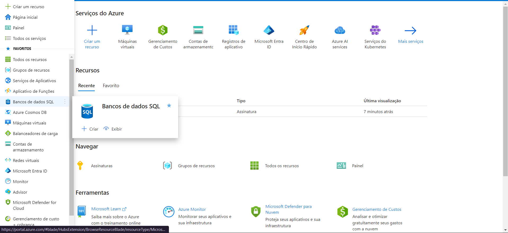
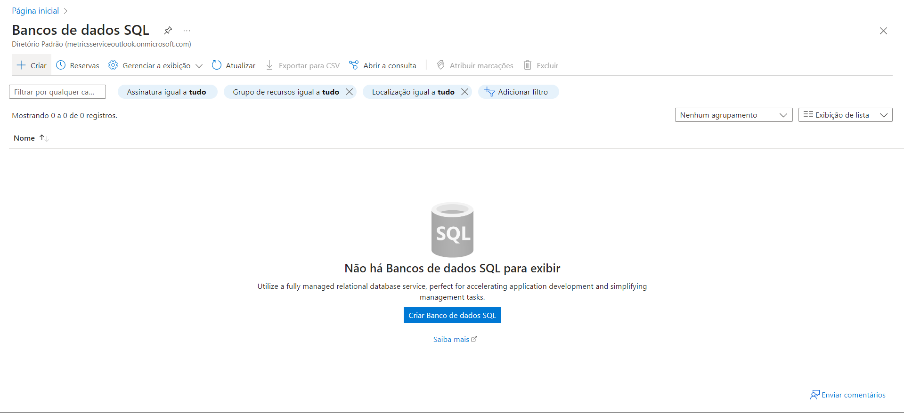
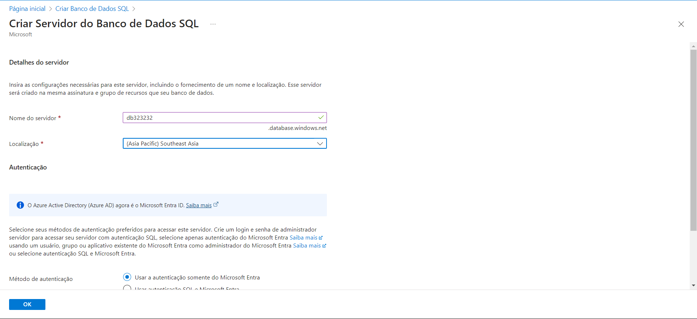
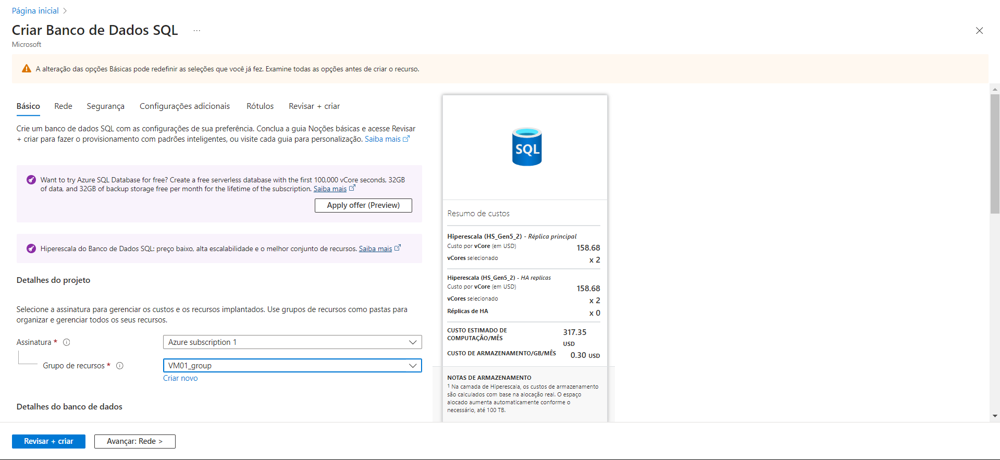
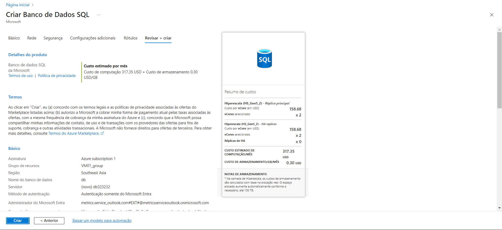
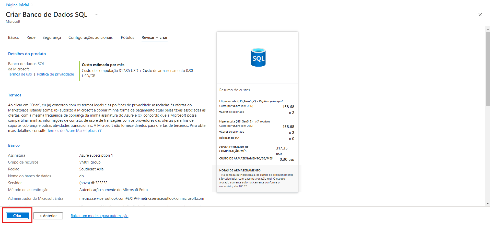

# Desafio 2: Configurando uma Instância de Banco de Dados no Azure

O segundo desafio foi configurar uma instância de banco de dados SQL no Azure. Aqui está o passo a passo que segui para completar essa tarefa.

### Passo 1: Acessar o Portal do Azure
Primeiro, acessei o [Portal do Azure](https://portal.azure.com). No menu lateral, procurei por **"Banco de Dados SQL"** e cliquei na opção. Depois, cliquei em **"Criar"** para iniciar o processo de configuração do banco de dados.  

### Passo 2: Iniciar a Criação da Instância
Na tela seguinte, cliquei no botão **"+ Criar"**. Um menu apareceu com algumas opções, e para esse desafio, segui com a opção padrão de instância SQL.  

### Passo 3: Configurando a Instância
Aqui, preenchi as informações básicas da instância, como o nome do banco de dados e a região. Também configurei o desempenho, mas como o foco era uma tarefa simples, mantive a maioria das opções no padrão.  

### Passo 4: Criar um Novo Servidor SQL
Como eu não tinha um servidor SQL criado, precisei configurar um novo. Foi necessário preencher os campos obrigatórios, como nome do servidor e login de administrador. Também defini um administrador no Microsoft Entra (antigo Azure AD).  

### Passo 5: Verificando a Estimativa de Custos
Após configurar o servidor, o portal mostrou uma estimativa dos custos mensais para manter o banco de dados ativo. Essa previsão ajuda a ter uma ideia do quanto será gasto conforme as configurações escolhidas.  

### Passo 6: Revisar as Configurações
Antes de finalizar, cliquei em **"Revisar + Criar"** para verificar todas as configurações feitas. Foi uma etapa importante para garantir que tudo estava certo antes de criar a instância.  

### Passo 7: Criar a Instância
Com tudo conferido, finalizei clicando em **"Criar"**. O Azure começou a provisionar a instância de banco de dados SQL, e em poucos minutos, ela estava pronta para ser usada.  

### Conclusão
Esse desafio foi uma ótima experiência para aprender a configurar um banco de dados no Azure. Seguindo esses passos, ficou claro como o processo funciona, e agora estou mais confiante para criar e gerenciar instâncias de banco de dados no futuro.
