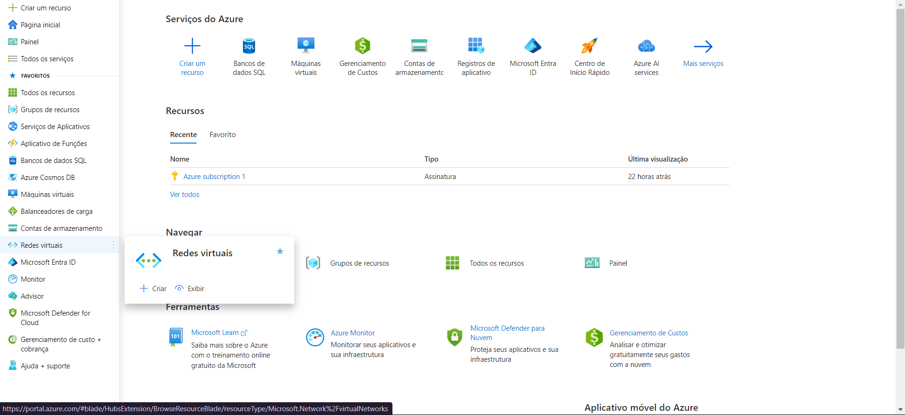
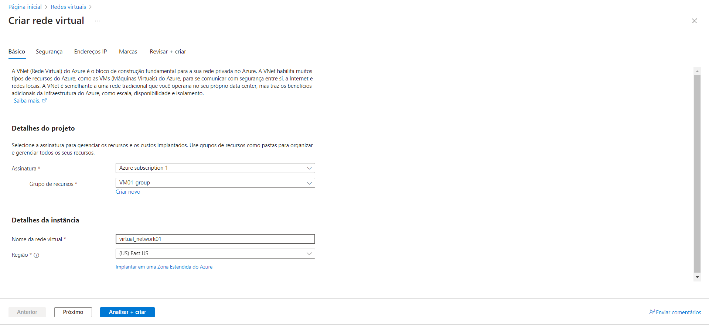
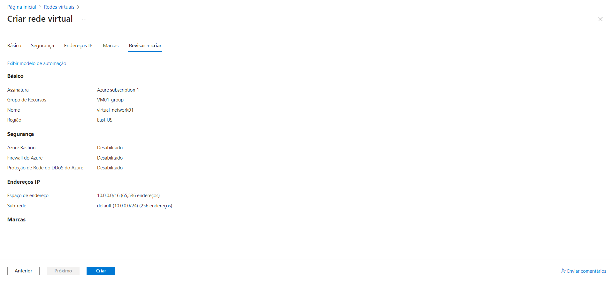
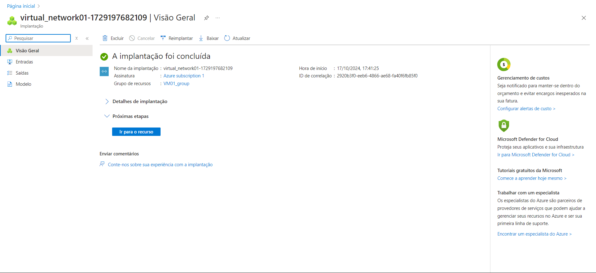
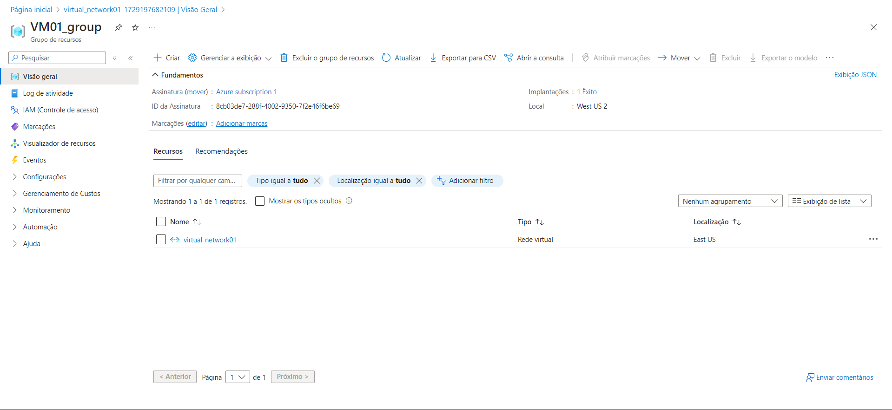

# Desafio 3: Construindo Arquiteturas no Azure

Neste desafio, o objetivo foi configurar uma rede virtual (VNet) no Azure. Abaixo, vou explicar como foi o processo e os passos que segui para concluir a tarefa.

### Passo 1: Acessando o Portal e Criando a Rede Virtual
O primeiro passo foi acessar o [Portal do Azure](https://portal.azure.com). No menu lateral, procurei pela opção **"Redes Virtuais"** e, em seguida, cliquei em **"+ Criar"** para começar a configuração.  

### Passo 2: Configurando a VNet
Na tela de criação, selecionei o **Grupo de Recursos** onde queria colocar minha VNet. Depois, dei um nome à rede, escolhi a região (que pode ser diferente da região do grupo de recursos) e cliquei em **"Analisar + Criar"** para revisar as configurações.  

### Passo 3: Revisão e Criação da VNet
Após preencher as informações, o próximo passo foi conferir todos os detalhes. Verifiquei se as configurações estavam corretas e, então, cliquei em **"Criar"** para finalizar o processo.  

### Passo 4: Verificando a Implementação
Depois de alguns minutos, a rede foi implementada com sucesso. Quando tudo terminou, a tela mostrou a nova VNet pronta para uso.  

### Passo 5: Conferindo a Rede no Grupo de Recursos
Por fim, voltei para o **Grupo de Recursos** para confirmar que a rede virtual havia sido criada corretamente. Lá estava a nova VNet disponível e pronta para ser utilizada.  

### Conclusão
Este desafio foi uma ótima oportunidade para entender como configurar redes virtuais no Azure. O processo é simples e, seguindo esses passos, consegui criar e gerenciar minha rede de forma eficiente.
