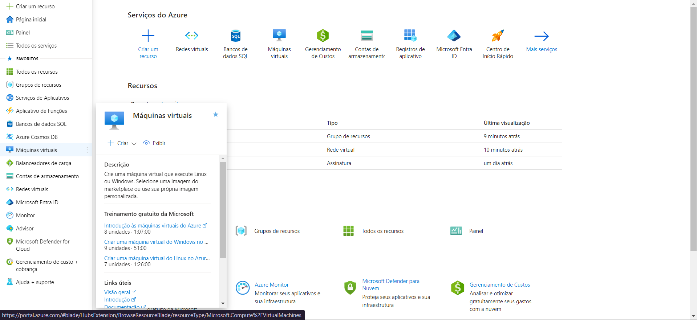
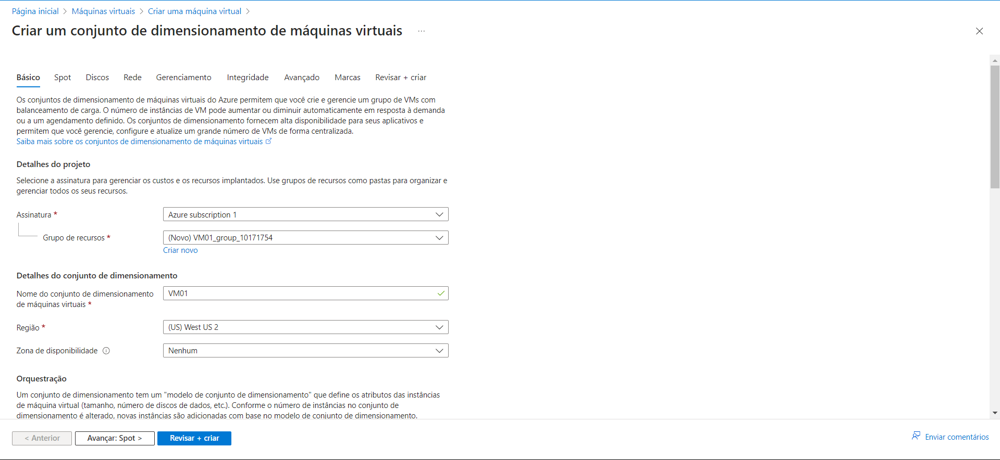
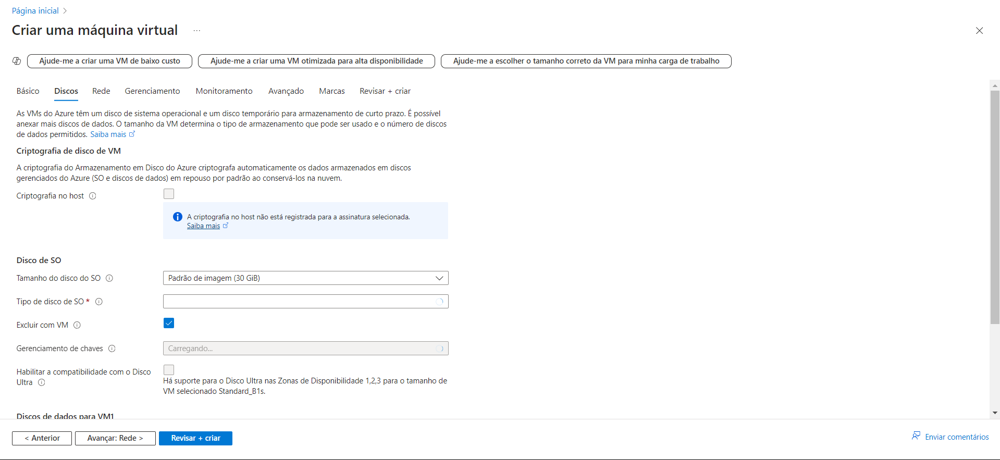
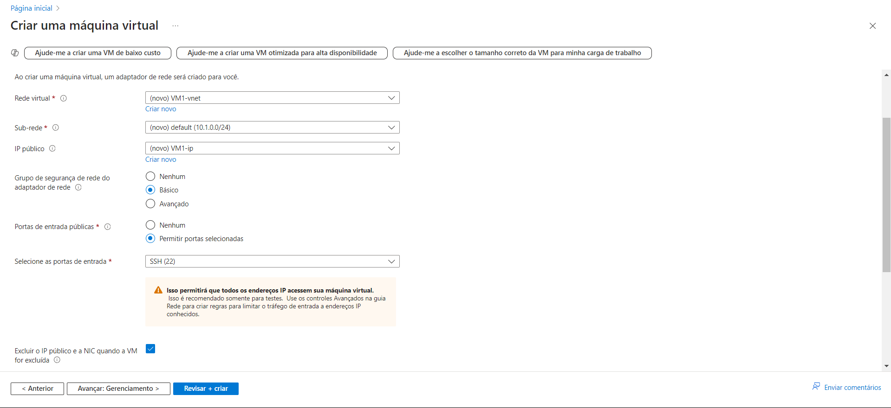
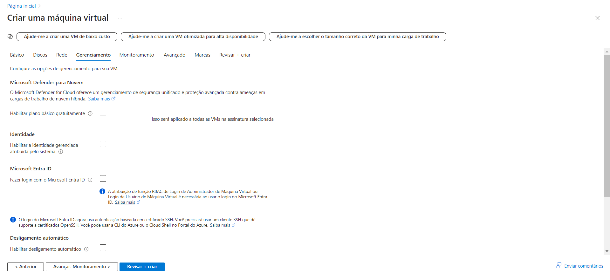
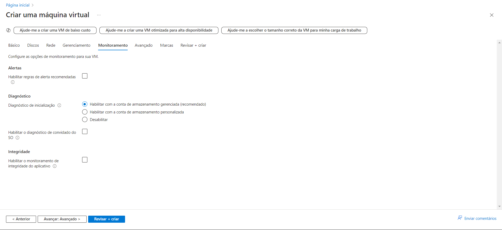
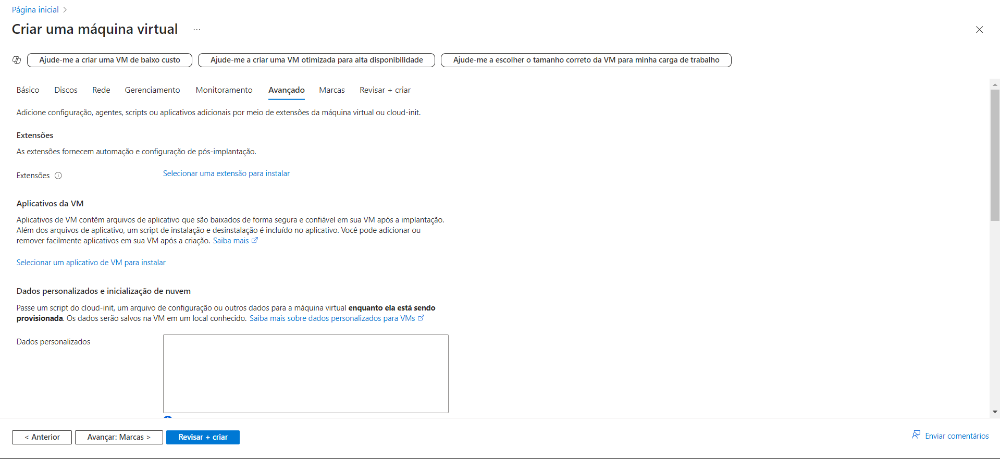
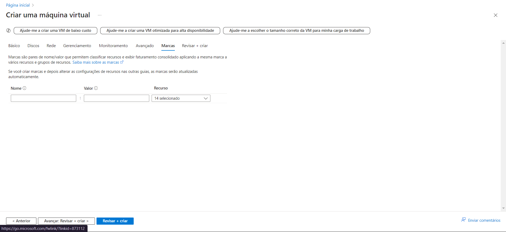
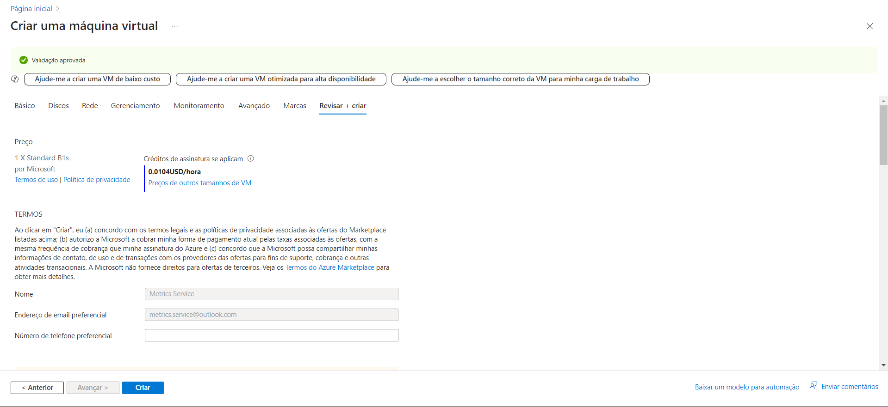

# Desafio 4: Configurando Recursos e Dimensionamentos em Máquinas Virtuais no Azure

Neste desafio, o objetivo foi configurar e dimensionar uma máquina virtual (VM) no Azure. Vou descrever passo a passo como foi o processo e as etapas que segui.

### Passo 1: Acessando o Portal e Criando a VM
Primeiro, entrei no [Portal do Azure](https://portal.azure.com) e, no menu lateral, procurei pela opção **"Máquinas Virtuais"**. Em seguida, cliquei em **"+ Criar"** para iniciar a criação da nova máquina.  

### Passo 2: Definindo o Grupo de Recursos e Nome da VM
Na tela de criação, escolhi o **Grupo de Recursos**, dei um nome para a VM e selecionei a região onde ela seria hospedada.  

### Passo 3: Selecionando Opções de Disponibilidade
Ao clicar em **"Opções de Disponibilidade"**, o menu suspenso me deu três opções. Escolhi **"Conjunto de Dimensionamento de Máquinas Virtuais"** para garantir alta disponibilidade e escalabilidade para a arquitetura do aplicativo.  

### Passo 4: Configurando os Discos
Cliquei em **"Avançar: Disco"** para configurar os discos de armazenamento e as opções de criptografia. Marquei a opção **"Excluir com a VM"** para evitar custos extras com discos que não seriam mais usados após a exclusão da VM.  

### Passo 5: Configurando a Rede
Na aba **"Rede"**, escolhi a rede existente, mas também existe a opção de criar uma nova. Os endereços IP públicos e as NICs são gerenciados separadamente das VMs, então selecionei a opção para excluir automaticamente esses recursos quando a VM for excluída.  

### Passo 6: Gerenciamento da VM
Na aba **"Gerenciamento"**, configurei as opções de segurança, desligamento automático, backups e atualizações do sistema operacional convidado (SO).  

### Passo 7: Monitoramento
Na aba **"Monitoramento"**, habilitei alertas para receber notificações de eventos importantes. Também ativei o diagnóstico para identificar problemas e o monitoramento de integridade para acompanhar o estado do conjunto de dimensionamento.  

### Passo 8: Configurações Avançadas
Na aba **"Avançado"**, adicionei agentes e scripts extras via extensões da VM. Também havia a opção de usar o **cloud-init** para configurar a máquina durante sua criação.  

### Passo 9: Aplicando Marcas
Em **"Marcas"**, configurei tags para facilitar a organização dos recursos e consolidar o faturamento entre diferentes grupos de recursos.  

### Passo 10: Revisão e Criação da VM
Por fim, revisei todas as configurações, chequei a estimativa de custos e finalizei o processo clicando em **"Criar"**. Agora, a VM estava pronta para uso.  

### Conclusão
Este desafio mostrou a importância de configurar corretamente recursos e dimensionamentos ao criar uma VM no Azure. O processo foi tranquilo, e as opções de monitoramento e gerenciamento oferecem um bom controle sobre a máquina criada.
