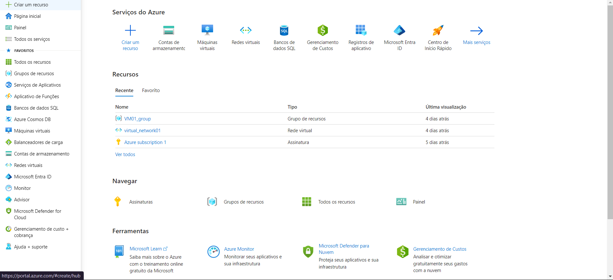
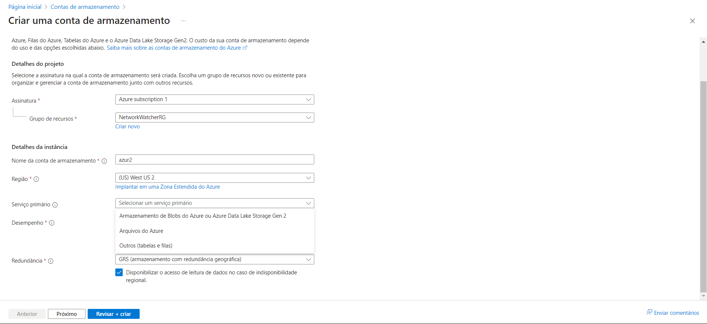
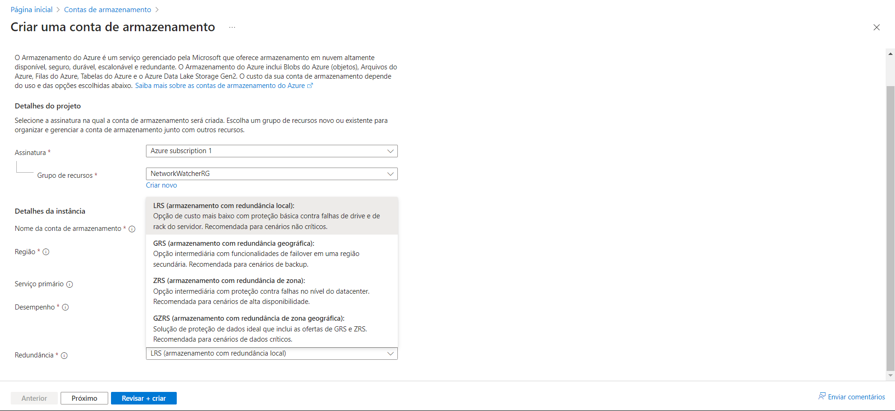
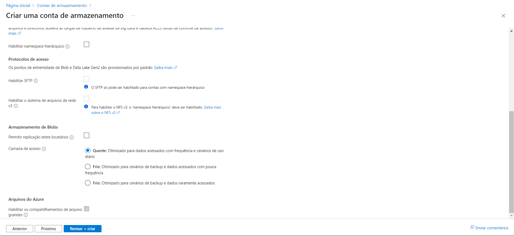
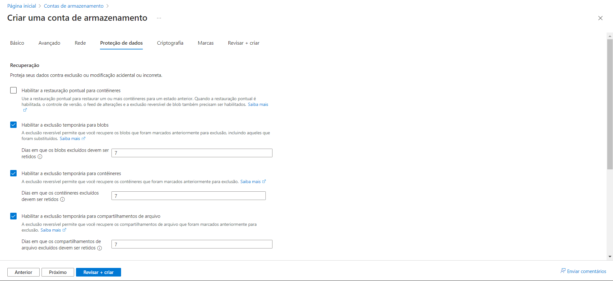
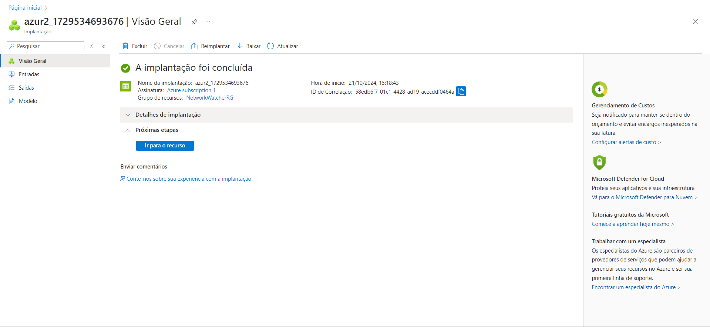

# Desafio 5: Dominando o Armazenamento na Azure

Neste desafio, o objetivo foi criar e configurar uma Conta de Armazenamento na Azure. A seguir, está o passo a passo que realizei durante o processo.

### Passo 1: Criando uma Nova Conta de Armazenamento
Primeiramente, no [Portal do Azure](https://portal.azure.com), naveguei até o menu lateral e procurei por **"Contas de Armazenamento"**.  

### Passo 2: Configurações Iniciais
Cliquei em **"+ Criar"**, selecionei a assinatura e o grupo de recursos apropriados, e forneci um nome globalmente único para a nova conta.  
Em **"Serviço Primário"**, defini o tipo de armazenamento desejado, podendo escolher entre blob, data lake, arquivos, tabelas ou filas.  

### Passo 3: Definindo a Redundância
Na opção **"Redundância"**, escolhi entre as opções disponíveis de acordo com a estratégia de armazenamento.  

### Passo 4: Configurando o Armazenamento de Blobs
Em seguida, na aba **"Armazenamento de Blobs"**, selecionei o modelo de armazenamento adequado, podendo escolher entre **quente** e **frio**, de acordo com a minha estratégia de uso.  

### Passo 5: Configurando a Rede
Na aba **"Rede"**, configurei as opções de conectividade para garantir uma integração eficiente com a rede.  

### Passo 6: Proteção de Dados
Na aba **"Proteção de Dados"**, ajustei as configurações de **Recuperação** para assegurar que a conta de armazenamento estivesse alinhada à estratégia de backup e recuperação de dados.  

### Passo 7: Criptografia e Marcas
As opções de **"Criptografia"** e **"Marcas"** foram mantidas com as configurações padrão, pois são mais avançadas. Em seguida, cliquei em **"Revisar + Criar"** e confirmei todas as configurações.

### Passo 8: Visão da Conta de Armazenamento
Após a implantação, a conta de armazenamento foi criada com sucesso e apareceu da seguinte maneira no painel de controle:  

### Conclusão
O processo de criação e configuração de uma conta de armazenamento na Azure é bastante intuitivo. Contudo, é importante prestar atenção nas diferentes opções, como redundância e proteção de dados, para garantir a segurança e eficiência no gerenciamento do armazenamento.
