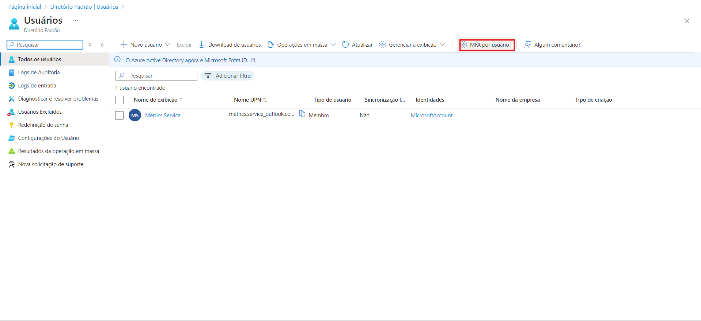
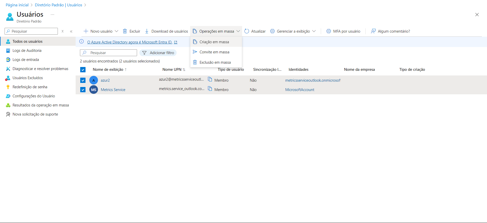

# Desafio 06: Entendendo Segurança e Identidade

Neste desafio, o objetivo foi explorar e configurar o Microsoft Entra ID. A seguir, está o passo a passo que realizei durante o processo.

### Passo 1: Acessando o Microsoft Entra ID
Primeiramente, no [Portal do Azure](https://portal.azure.com), naveguei até o menu lateral e procurei por **"Microsoft Entra ID"**.  

### Passo 2: Explorando o Menu de Gerenciamento
No painel principal, um novo menu foi adicionado na barra lateral esquerda, com opções para gerenciar usuários, grupos e identidades externas. No topo do painel, além do recurso habitual de **"Criar/Adicionar"**, destaquei a opção de **"Gerenciar Locatários"**. A aba **"Monitoramento"**, localizada mais abaixo, é útil para gerenciar um grande número de usuários e grupos.  

### Passo 3: Gerenciando Usuários
Clicando em **"Usuários"** na aba de gerenciamento, um painel se abriu mostrando todos os usuários já criados e as opções de gerenciamento disponíveis. Um ponto importante é a opção de **Autenticação Multifator (MFA)**, acessível na barra lateral esquerda.  

## Criando Usuários

### Passo 4: Criando um Novo Usuário
Ao clicar em **"Novo Usuário"**, o menu dropdown oferece duas opções: **criar um novo usuário** ou **convidar um usuário externo**. Escolha a que melhor se adequa ao seu projeto, lembrando que, para convidar um usuário externo, basta ter o endereço de e-mail.  

Se você optar por **criar um novo usuário**, será direcionado para um painel de configuração. Lembre-se de preencher todos os itens necessários e, em seguida, clique em **"Criar"**.  

### Passo 4.1: Gerenciamento em Massa de Usuários
De volta ao painel de usuários, é possível realizar o **gerenciamento em massa**. Você pode criar, convidar e excluir usuários em lotes. Ao escolher qualquer uma das três opções de gerenciamento em massa, um popup lateral será aberto, permitindo que você realize a tarefa utilizando um arquivo **CSV**.  

## Funções e Administradores

### Passo 5: Administrando Funções
Voltando ao painel principal do Entra ID e selecionando **"Funções"**, você acessa o painel de gerenciamento de **"Roles"**, onde pode administrar acessos para ações privilegiadas.  

Na barra de pesquisa, você pode procurar pelo tipo de privilégio que deseja conceder.

### Conclusão
Explorar e configurar o Microsoft Entra ID é um processo direto e eficiente. É fundamental entender as diversas opções de gerenciamento, especialmente em relação a usuários e funções, para garantir uma abordagem robusta em segurança e identidade.
