# Desafio 07 - Otimizando Custos no Azure

Neste desafio, busquei explorar e configurar ferramentas para melhorar a eficiência de custos no Azure. Veja o passo a passo que segui durante o processo.

### Passo 1: Acesso à Calculadora do TCO
Inicie acessando a [Calculadora do TCO (Custo Total de Propriedade)](https://azure.microsoft.com/pt-br/pricing/tco/calculator/).  
Essa ferramenta é útil para estimar a economia que pode ser gerada ao migrar suas cargas de trabalho para o Azure.  
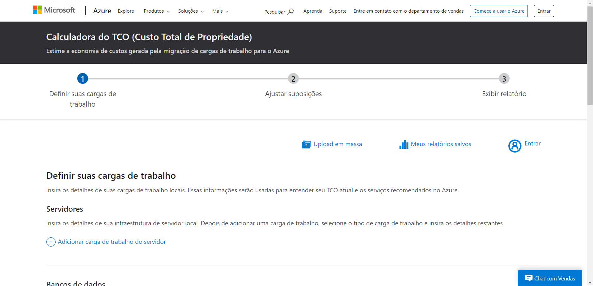

### Passo 2: Configuração das Cargas de Trabalho
Informe os detalhes das suas cargas de trabalho que estão atualmente em seu ambiente local. Essas informações ajudarão a calcular o TCO e a sugerir serviços apropriados no Azure.

- **Servidores**: Forneça os dados sobre sua infraestrutura de servidores. Após adicionar uma carga de trabalho, escolha o tipo e complete os demais detalhes.  
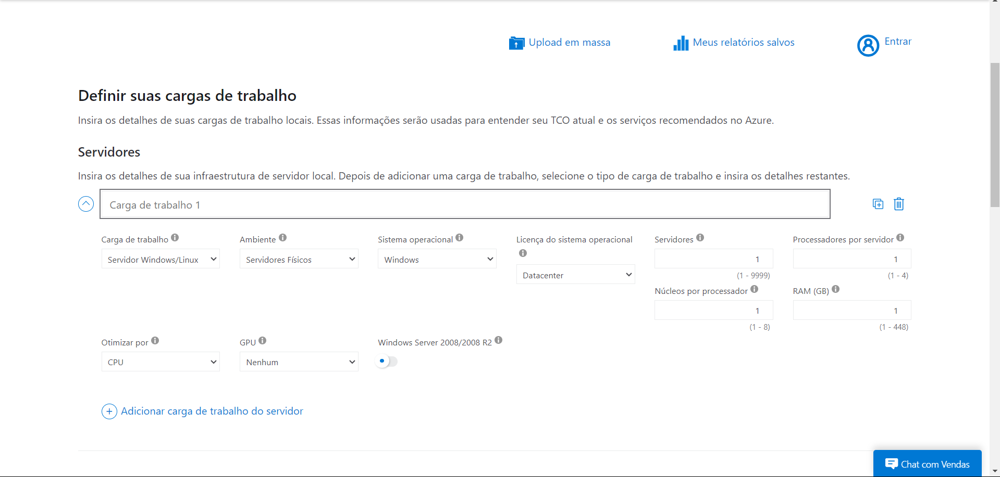

### Passo 3: Informações sobre Banco de Dados
- **Bancos de dados**: Adicione os detalhes de sua infraestrutura de banco de dados local. Após incluir um banco, insira as informações na seção de Origem. Na seção de Destino, escolha o serviço do Azure que deseja utilizar.  
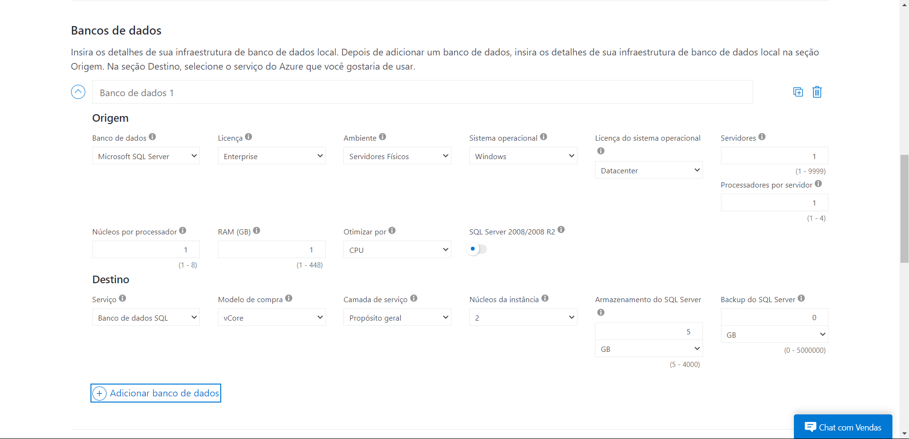

- **Armazenamento e Rede**: Preencha as informações sobre sua infraestrutura de armazenamento. Após adicionar o armazenamento, selecione o tipo e forneça os detalhes restantes. Para a rede, informe a largura de banda utilizada em seu ambiente local.  
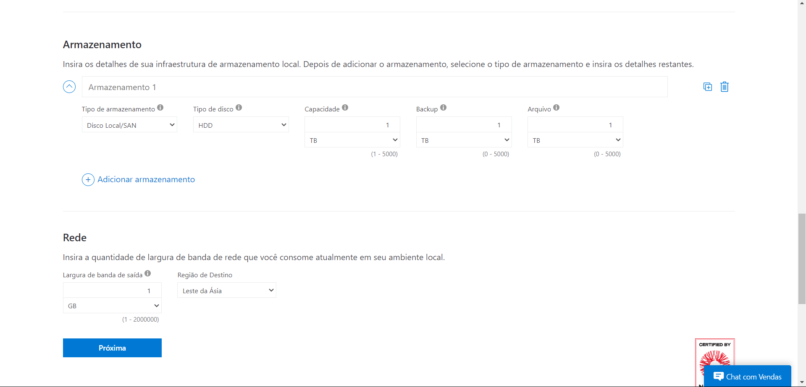

### Passo 4: Ajustando as Suposições
As suposições apresentadas no modelo de TCO são médias do setor, conforme indicado pela Nucleus Research. Para um relatório de TCO mais preciso, considere personalizar esses valores para refletir sua realidade, que pode variar de acordo com o setor e a localização.  
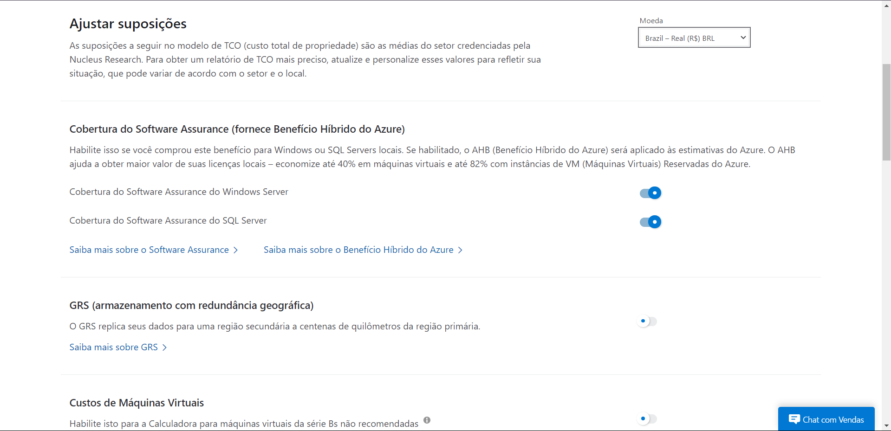

### Passo 5: Visualizando o Relatório
Confira a projeção de custos com base no período, região e programa de licenciamento. Você poderá comparar os custos do ambiente local com os da nuvem do Azure.  
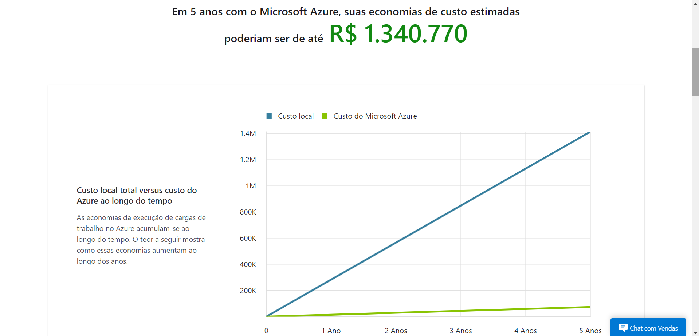  
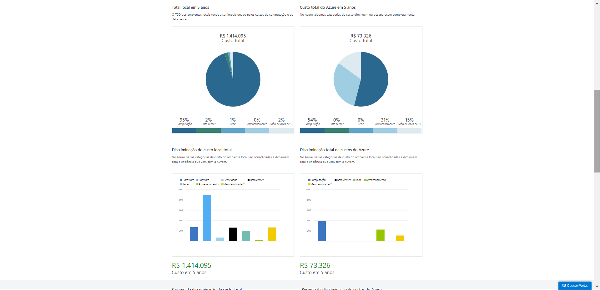

É possível também baixar, compartilhar ou salvar as estimativas que foram calculadas até esse ponto.

### Passo 6: Acesso à Calculadora de Preços do Azure
Visite também a [Calculadora de Preços do Azure](https://azure.microsoft.com/pt-br/pricing/calculator) para calcular os custos estimados de uso do Azure, seja por hora ou mensalmente. Navegue pelo menu lateral para acessar todos os serviços e recursos disponíveis.  
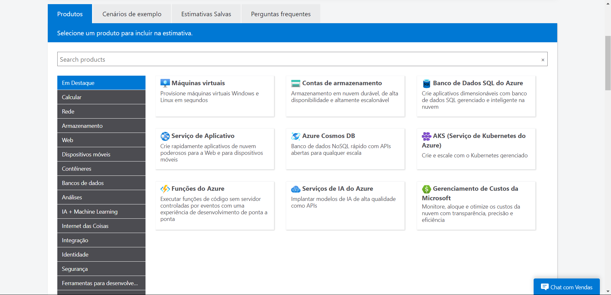

### Passo 7: Gerenciamento de Custos e Cobrança
Retorne ao portal do Azure e procure a opção **"Gerenciamento de custo + cobrança"** no menu lateral.  
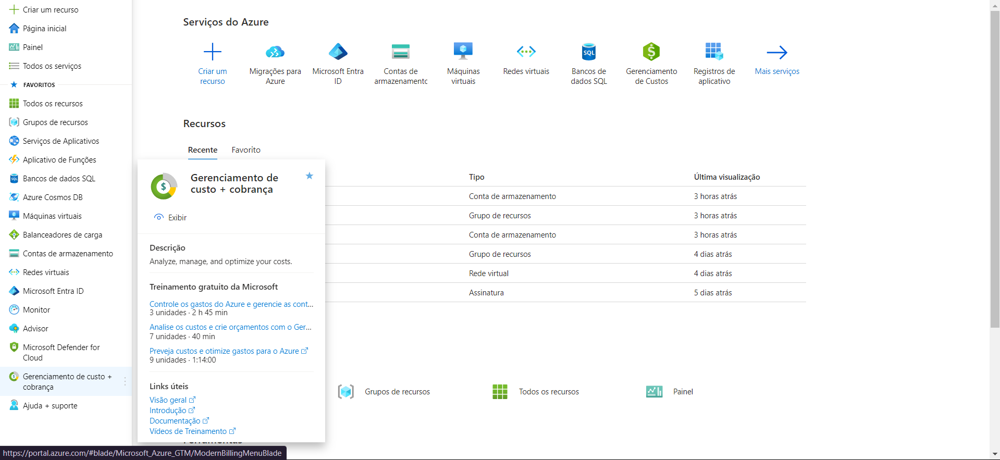

Os escopos de orçamento determinam seu nível de acesso. Você pode ter acesso a vários escopos, como uma conta de cobrança para projetos pessoais ou a da sua organização. Abaixo está a lista de escopos disponíveis em seu diretório padrão.  
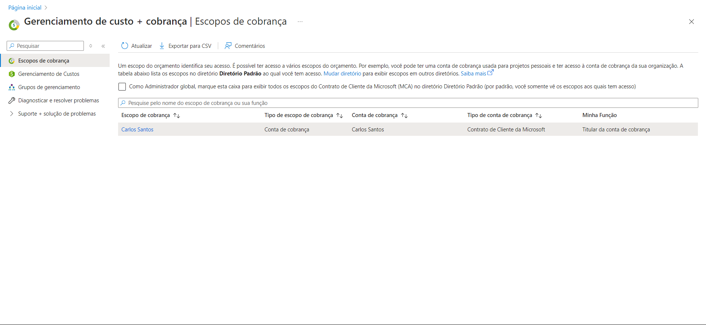

Clique em uma das contas de cobrança disponíveis. Você será direcionado ao resumo de cobrança, onde encontrará diversas opções importantes no menu lateral para ajustar o que for necessário para seu projeto.  
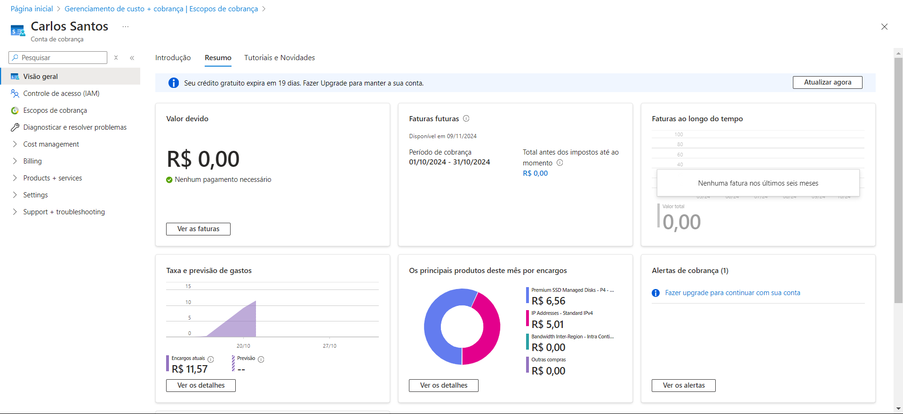

Uma dica valiosa é utilizar a funcionalidade de **"Recomendações do Assistente"**, que pode ajudar a identificar oportunidades para a otimização de custos.  
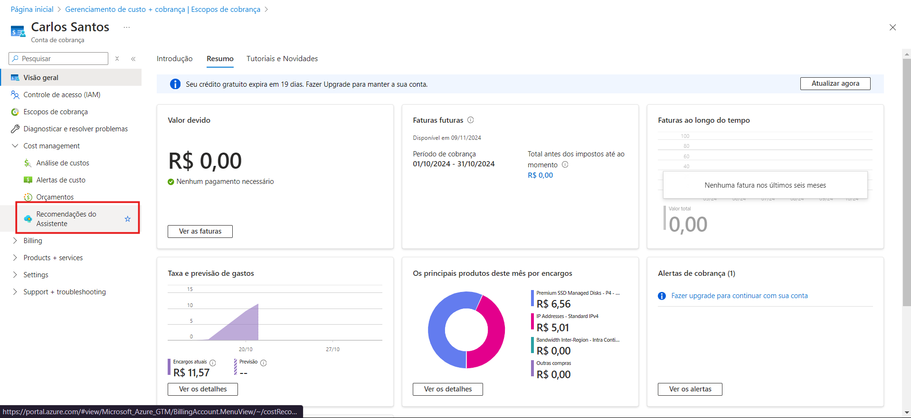
