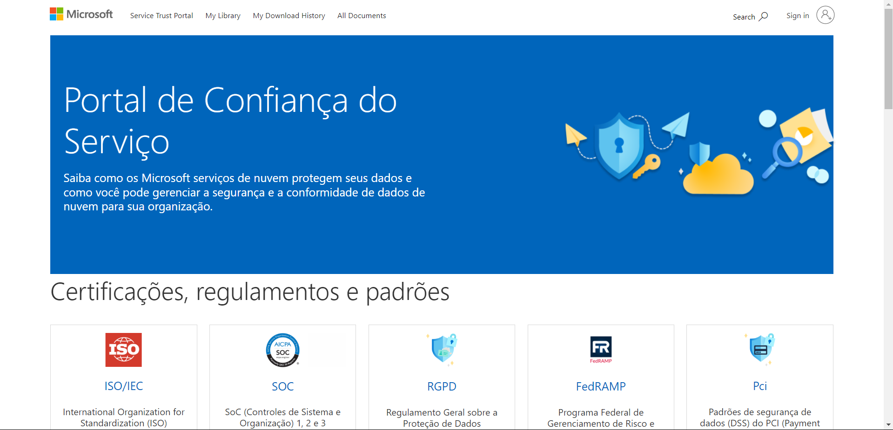
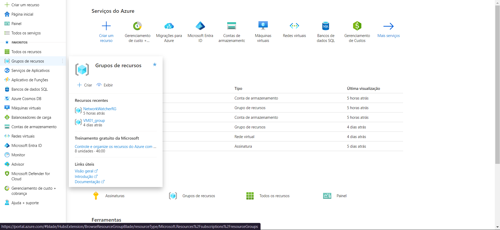
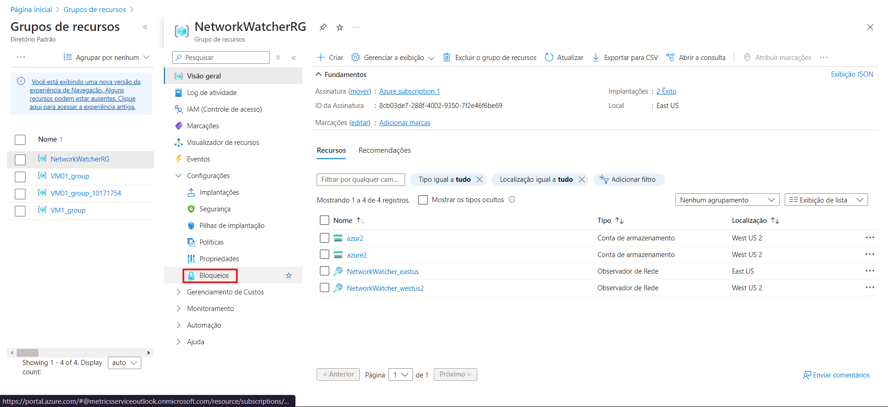
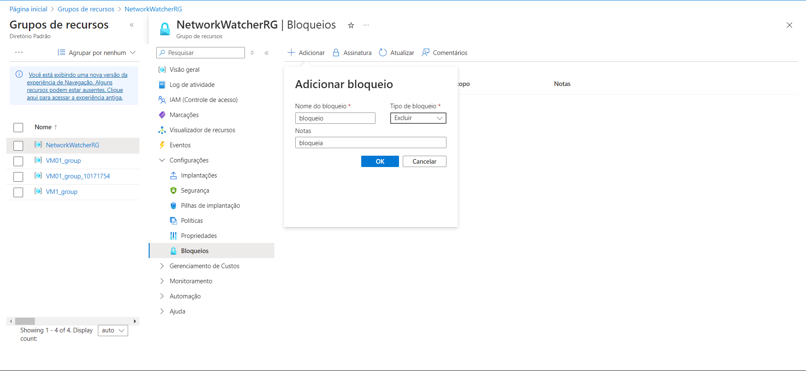
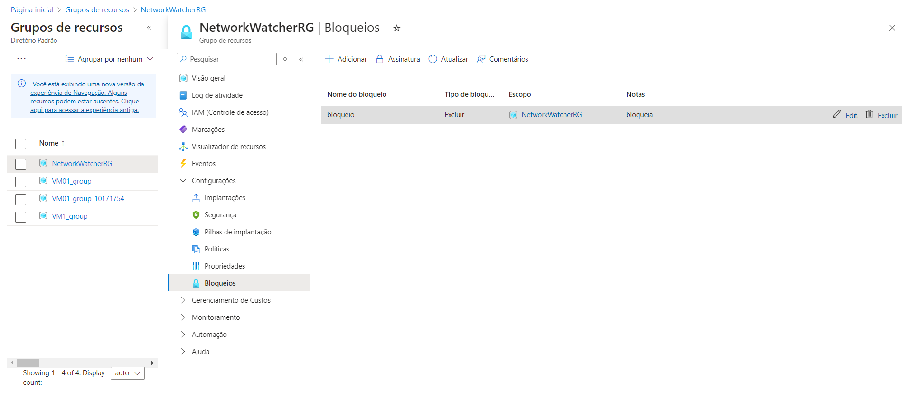
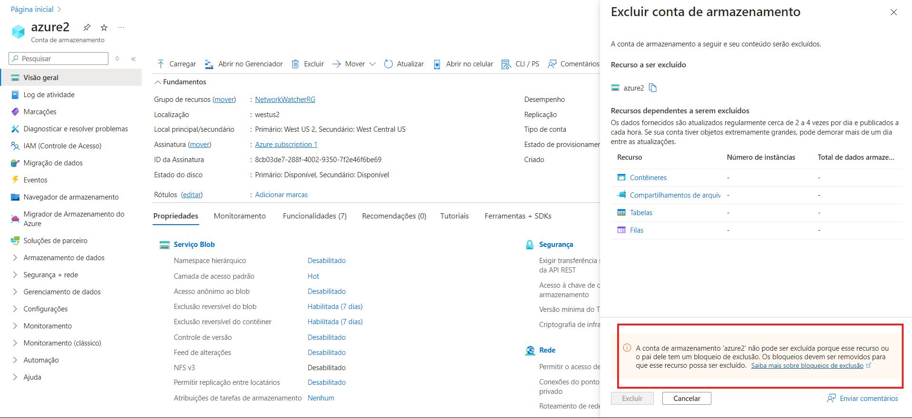
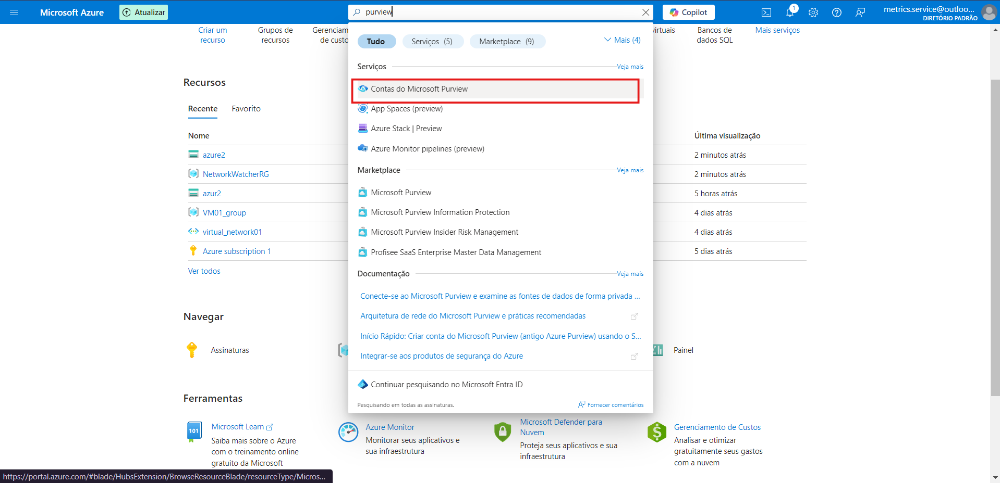
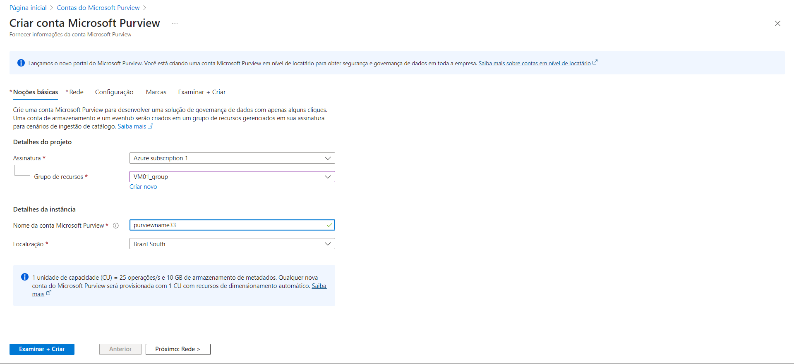
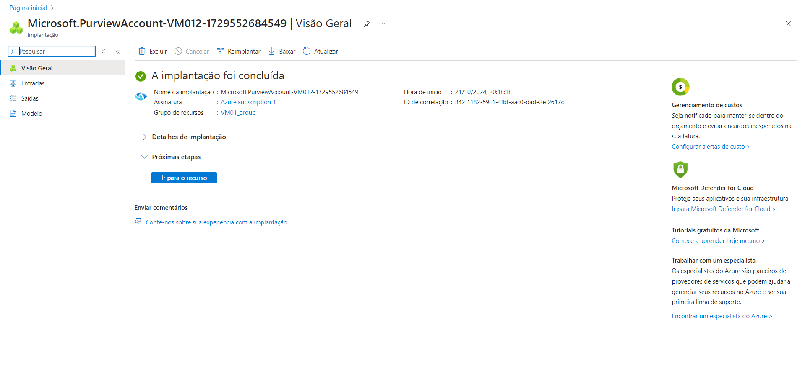

# Desafio 08 - Gerenciando Políticas de Acesso no Azure

Neste desafio, o objetivo foi explorar o gerenciamento de políticas no Azure, utilizando ferramentas que ajudam a controlar o acesso e garantir a conformidade de recursos. Confira os passos a seguir.

### Passo 1: Acessando o Portal de Confiança do Serviço
Comece acessando o [Portal de Confiança do Serviço](https://servicetrust.microsoft.com).  
Essa plataforma da Microsoft oferece transparência sobre as práticas de segurança e conformidade dos serviços de nuvem.  

### Passo 2: Explorando o Azure Policy
O Azure Policy é uma ferramenta fundamental para aplicar regras de conformidade em sua infraestrutura na nuvem. Ele garante que seus recursos sigam as políticas estabelecidas.  

### Passo 3: Criando Bloqueios no Grupo de Recursos
No portal do Azure, vá até um **Grupo de Recursos** e, no menu lateral, selecione a opção **Bloqueios**. Essa ação permitirá que você adicione um bloqueio para garantir que nenhum recurso seja removido acidentalmente.  

### Passo 4: Adicionando um Bloqueio
Clique em **Adicionar**, dê um nome ao bloqueio e escolha o tipo desejado no menu suspenso. Em seguida, clique em **OK** para aplicar o bloqueio ao grupo de recursos.  

### Passo 5: Testando o Bloqueio em um Recurso
Agora, vá até a visão geral do seu grupo de recursos, selecione um dos recursos listados e tente realizar uma exclusão. Ao tentar, você verá que o bloqueio foi aplicado com sucesso, impedindo a ação.  

### Passo 6: Mensagem de Bloqueio ao Excluir
Se tudo estiver configurado corretamente, ao tentar excluir o recurso bloqueado, você verá uma mensagem indicando que a ação foi impedida pelo bloqueio configurado.  

### Passo 7: Acessando o Microsoft Purview
O [Microsoft Purview](https://azure.microsoft.com/en-us/services/purview/) é uma plataforma de governança de dados que ajuda a monitorar e proteger informações em ambientes de nuvem e locais. No Azure, você pode acessar o Purview utilizando a barra de pesquisa.  

### Passo 8: Criando uma Conta no Purview
Clique em **+ Criar** e preencha as informações do projeto. Escolha um nome para a conta do Purview e defina a localização desejada. Clique em **Examinar + Criar** para finalizar.  

### Passo 9: Acessando a Conta Criada
Após a criação da conta, você poderá acessá-la no painel do Purview. Nesse painel, estarão disponíveis links e opções de monitoramento para ajudá-lo a gerenciar seus dados de forma eficiente.  

