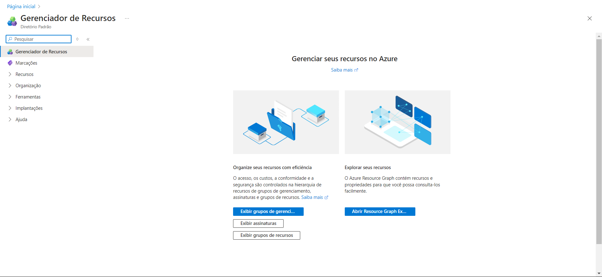
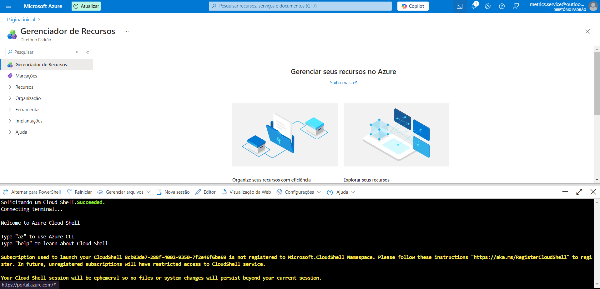
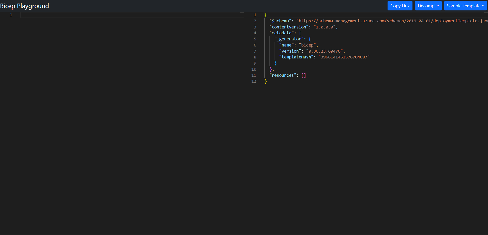

# Desafio 09 - Ferramentas de Implantação no Azure

Neste desafio, o foco foi explorar ferramentas essenciais para a implantação e gerenciamento de recursos no Azure. Abaixo estão os principais conceitos e ferramentas utilizados.

### Passo 1: Explorando o Azure Arc
O **Azure Arc** permite gerenciar centralmente recursos em ambientes híbridos e multicloud. Ele estende os serviços do Azure para qualquer infraestrutura, facilitando o gerenciamento de servidores, clusters Kubernetes e bancos de dados fora do Azure.  

Principais funcionalidades do Azure Arc:
- **Gerenciamento de servidores**: Administra servidores físicos e máquinas virtuais fora do Azure.
- **Gerenciamento de Kubernetes**: Orquestra clusters Kubernetes locais e em outras nuvens.
- **Gerenciamento de dados**: Oferece serviços como Azure SQL Managed Instance em ambientes on-premise.

### Passo 2: Utilizando o Azure Resource Manager (ARM)
O **Azure Resource Manager (ARM)** é a camada de gerenciamento que organiza, provisiona e monitora recursos no Azure. Ele utiliza templates declarativos para automatizar a criação de recursos de maneira consistente.  

Principais ferramentas do ARM:
- **Templates ARM**: Arquivos JSON que automatizam a implementação de recursos.
- **Grupos de recursos**: Organizam e gerenciam serviços de forma coesa.
- **RBAC (Role-Based Access Control)**: Oferece controle granular de permissões.
- **Tags**: Etiquetas que facilitam a categorização e identificação de recursos.

### Passo 3: Executando Comandos com o Cloud Shell
O **Cloud Shell** é um terminal baseado no navegador que permite a execução de comandos diretamente no portal do Azure, sem a necessidade de configurar um ambiente local. Ele oferece ambientes Bash e PowerShell para gerenciar recursos via linha de comando.  

Como acessar o Cloud Shell:
1. Faça login no Portal do Azure.
2. Clique no ícone de **Cloud Shell** no canto superior direito.
3. Selecione o ambiente (Bash ou PowerShell).
4. O terminal estará pronto para uso diretamente no navegador.

### Passo 4: Utilizando o Bicep para Infraestrutura como Código (IaC)
**Bicep** é uma linguagem declarativa de código-fonte aberto projetada para simplificar a criação de templates de infraestrutura no Azure. Ele é uma alternativa mais concisa aos arquivos JSON dos ARM Templates, facilitando o provisionamento de recursos.  

Como usar o Bicep:
1. Pode ser utilizado diretamente no **Azure CLI** ou **Azure PowerShell**.
2. Instale a CLI do Bicep para compilar arquivos `.bicep` em ARM templates.
3. Integre em pipelines CI/CD para automação de implantações.

🔗 Explore mais sobre Bicep no [Playground do Bicep](https://azure.github.io/bicep).
