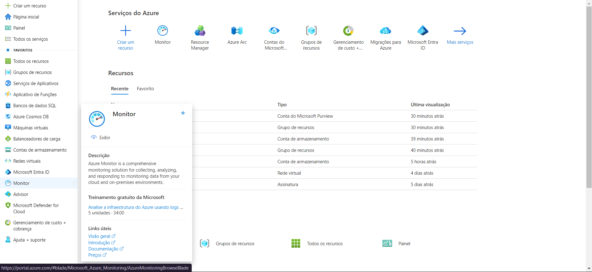
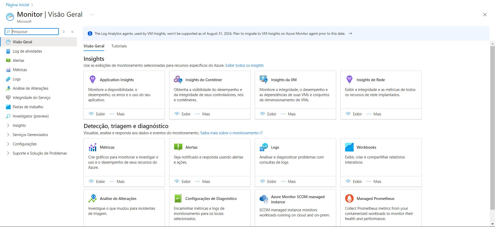
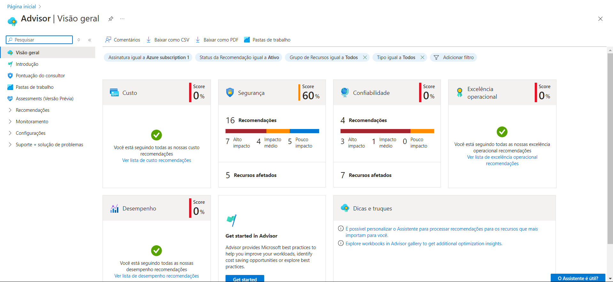
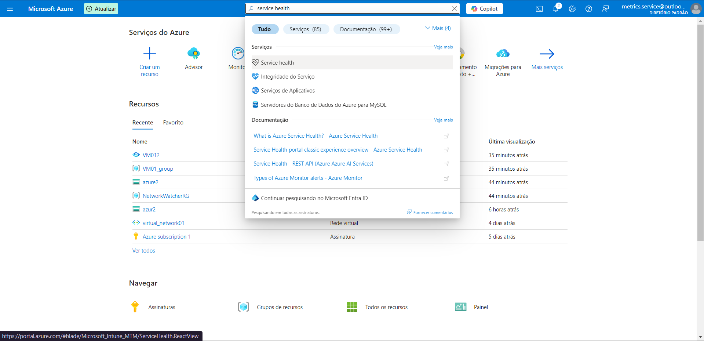

# Desafio 10 - Monitoramento Inteligente com o Azure

Neste desafio, o objetivo foi explorar as ferramentas de monitoramento no Azure que ajudam a garantir a saúde, desempenho e segurança dos recursos em nuvem.

### Passo 1: Explorando o Azure Monitor
O **Azure Monitor** é a principal solução de monitoramento do Azure. Ele coleta, analisa e visualiza dados de métricas e logs de recursos do Azure e ambientes híbridos. Com o Monitor, é possível observar a integridade e o desempenho de máquinas virtuais, bancos de dados, containers e outros serviços.  

Funcionalidades principais do Azure Monitor:
- **Métricas**: Fornece dados numéricos em tempo real sobre o desempenho dos recursos.
- **Logs**: Registra atividades e eventos detalhados dos serviços.
- **Alertas**: Configura notificações automáticas com base em condições pré-definidas, como o uso de CPU ou memória.

### Passo 2: Explorando a Interface do Azure Monitor
Na tela inicial do Azure Monitor, é possível visualizar métricas, logs e configurar alertas para monitoramento proativo dos recursos.  

### Passo 3: Utilizando o Azure Advisor
O **Azure Advisor** oferece recomendações personalizadas para otimizar seu ambiente Azure, com foco em cinco categorias principais: custo, segurança, confiabilidade, desempenho e excelência operacional. Ele analisa o ambiente e fornece sugestões práticas para melhorar suas operações.  

Como acessar o Azure Advisor:
1. Pesquise por "Azure Advisor" na barra de pesquisa do Portal do Azure.
2. Clique no **Azure Advisor** nos resultados.
3. Revise as recomendações para otimizar seu ambiente em termos de segurança, custo, desempenho e confiabilidade.

### Passo 4: Tela Inicial do Azure Advisor
A tela inicial do Advisor apresenta recomendações que podem ser aplicadas diretamente para melhorar a eficiência e segurança do ambiente.  

### Passo 5: Explorando o Azure Service Health
O **Azure Service Health** é uma ferramenta que fornece informações em tempo real sobre o status dos serviços Azure e o impacto de incidentes ou manutenções no seu ambiente. Ele oferece alertas e atualizações sobre eventos operacionais, permitindo que os usuários gerenciem e mitiguem possíveis impactos na disponibilidade e desempenho dos serviços.  

Como acessar o Service Health:
1. Pesquise por "Service Health" na barra de pesquisa do Portal do Azure.
2. Clique no **Service Health** nos resultados.
3. Verifique o status atual e o histórico de incidentes e manutenções nos serviços Azure.

> Nota: A imagem do Service Health não foi gerada porque a conta utilizada não tinha permissão para acesso (conta gratuita do Azure).
